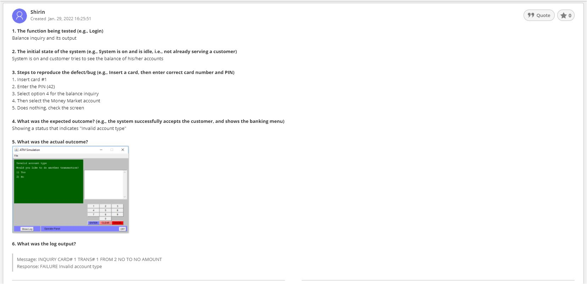
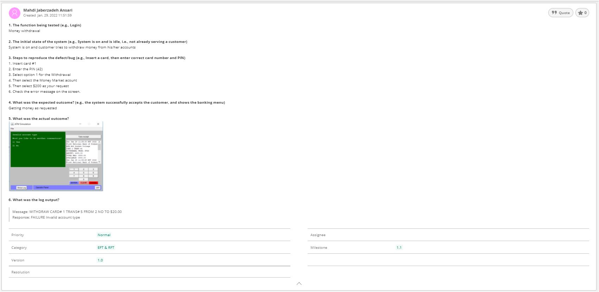

>   **SENG 637- Dependability and Reliability of Software Systems**

**Lab. Report \#1 – Introduction to Testing and Defect Tracking**

| Group \#:       |             4               |
|-----------------|-----------------------------|
| Student Names:  |  1. Mahdi Jaberzadeh Ansari |
|                 |  2. Aadharsh Hariharan      |
|                 |  3. Shirin Yamani           |
|                 |  4. Rahul Ravi              |

**Table of Contents**
- [Introduction](#introduction)
  - [!An example of our tickets](#)
- [Link of demo video](#link-of-demo-video)
- [High-level description of the exploratory testing plan](#high-level-description-of-the-exploratory-testing-plan)
  - [!An example of tickets reported during EFT](#-1)
- [Comparison of exploratory and manual functional testing](#comparison-of-exploratory-and-manual-functional-testing)
- [Notes and discussion of the peer reviews of defect reports](#notes-and-discussion-of-the-peer-reviews-of-defect-reports)
- [How the pair testing was managed and team work/effort was divided](#how-the-pair-testing-was-managed-and-team-workeffort-was-divided)
- [Difficulties encountered, challenges overcome, and lessons learned](#difficulties-encountered-challenges-overcome-and-lessons-learned)
- [Comments/feedback on the lab and lab document itself](#commentsfeedback-on-the-lab-and-lab-document-itself)

# Introduction

In this lab, we tested a piece of software system that simulated the functionality of an automated teller machine (ATM). The provided software had two versions:

- Version 1.0: was the first release
- Version 1.1: claimed is a version without reported bugs

As the aim of this lab is to simulate different stages of an agile development, and we assumed to be the customer who ordered the software and need to test the software, we received the software as a black-box and we tested it against the requirements. 

So what we have done is actually two different testing strategies. 
1. One based on a clear test plan that some software architect has written down the scenario before the actual testing (Manual Functional Testing).
2. And the other one based on the expectation of the customer regarding the requirements without any test plan to simulate the behavior of the actual end user (Exploratory Testing).

To do so, we used a bug reporting system called Backlog by Nulab and we defined a category list as following:

- EFT: When we found the error in the Exploratory Functional Testing
- MFT: When we found the error in the Manual Functional Testing
- RFT: When we found the error in the Regression Functional Testing
- And their combinations like (EFT & MFT) when we observed the error not only in exploratory testing but also during the manual functional testing. 

Also we kept a template of six to seven questions for all bug tickets to make it clear for the developer to know where to start, how to reproduce the bug and the other helpful outputs like the log output, the screen and or the printer output during the test. Here is an example of our tickets:

---

Before doing this lab, we knew the exploratory testing which is called monkey testing in the industrial world is a testing based on the end user's expectations or understanding of the functionalities of the software system, and manual functional testing as is clear from its name coming from a manual that is made normally by the developers based on their expectations from what they developed based on the requirements.

# Link of demo video 

Our ten minutes video can be found here:

[https://github.com/seng637-winter-2022/seng637-a1-mjza/blob/main/media/Demo.mp4](https://github.com/seng637-winter-2022/seng637-a1-mjza/blob/main/media/Demo.mp4)

# High-level description of the exploratory testing plan

The exploratory testing plan involved assessment of the tool in the order of functionalities we came across in the Menus and the order of operations being performed while using the ATM. The system requirements and developer knowledge were not taken into consideration. The testing was purely done in terms of customer's point of view. We started off by dividing the features that were observed on a high level and began following a top down approach to the point where system could serve the users. As we carried them out, the issues were logged under "EFT" category in the backlog.

For example, here you can see one of the tickets that we have reported during the exploratory test. However, if you notice the category this error still exist in the new version and has been observed during regression testing. Therefore, the category changed to **EFT & RFT** and also the status is still in the **progress**. 

---

# Comparison of exploratory and manual functional testing

In our point of view, both of them our valuable. We observed that there could be some bug reports that have been found during the exploratory testing phase which have not been noticed in any of the test cases in the manual test scenario. However, there were some bugs that have been reported during the both EFT and MFT phases. Here are the key differences:

- MFT: Conducted based on test cases written by developers with regard to the system requirements and significance of features developed.

- EFT: From customer’s point of view with only a high level assumption of how the system is supposed to work, based on feedbacks from system responses.

- Benefits: 
    1. MFT: Allows testers to make sure the existing functionalities are working properly, requirements are satisfied.
    2. EFT: Unbiased testing from developer influence to check the overall working of the system.

- Tradeoffs: 
    1. MFT: Customer satisfaction is not given priority as the basic requirements are primarily tested.
    2. EFT: Knowledge of backend code implementation and requirement are ignored which makes it difficult to identify the place the bug arose from.

- Effectiveness: 
    1. MFT: It is slightly less effective than EFT as usability, which is one of the important aspects, is ignored and biased towards developers, especially in test scenarios we define the order of the user's behavior, however, user normally can follow any arbitrary paths when using the system.
    2. EFT – More effective if done thoroughly as it places emphasis on user acceptance and usability. In most cases it could cover portions of MFT cases as well. As we experienced during our tests of the ATM software.

- Efficiency: 
    1. MFT: It exhibits high efficiency as it is based on precisely recorded test cases with initial state, steps to do, expected outcome, etc. as developers know their implementation well.
    2. EFT: It is efficient in terms of coverage and usability but could potentially miss some scenarios or improper identification of root causes since it is done causally without a formal documentation.

As a outcome of our work, we have submitted a report generated by our defect tracking system, containing all defects recorded in the system can bee accessed from this GitHub [link](https://github.com/seng637-winter-2022/seng637-a1-mjza/blob/main/Backlog-Issues-20220130-0924.xlsx).

# Notes and discussion of the peer reviews of defect reports

First of all, peer reviewing gave this opportunity to learn team work during the test as we experienced it during peer developing several times. 

It helped us to find more potential bugs. We discussed about the different features that needed to be test. Also, it helped us to record the steps for reproducing the bugs easier. 

Also, if person A was the observer and person B was the performer during the exploratory phase, we switched the roles when we wanted to evaluate the repots during the regression phase. Therefore, person B was the performer and person A was the observer in the regression testing phase.   

# How the pair testing was managed and team work/effort was divided 

Regarding the workload, we divided to two groups, the first group (Shirin and Mahdi) more focused on the exploratory testing and the second group (Rahul and Aadharsh) more focused on the manual functional testing and finally we did the regression testing all together. 

# Difficulties encountered, challenges overcome, and lessons learned

- Difficulties:

    Some of the tests cases in MFT were difficult to comprehend. As testers, without association with the developers, we faced difficulties while reading sections of the test cases such as initial states, expected outcomes and so on, as the point that is being made is not properly communicated. Again, we could attribute this problem to the bias experienced by developers with knowledge of their code and functions. Sometimes, the tests could be replicated in both MFT and EFT while working on them separately.

- Challenges Overcome:

    It was a challenge to cover every part of the software during EFT which was overcome by teamwork and division of work among the peers to test the functionalities in parallel in the top down approach. Coordination with the team on a regular basis allowed identification of redundant issues which were prevented at early stages before retesting during regression tests on newer version.

- Lessons learnt:

    Coordination among testers is important to avoid discrepancies and duplications.
    System knowledge is partly required to better carry out tests, specifically in MFTs and to read the developer’s cases better. Coverage is important when it comes to EFT with unbiased outlook (on development knowledge) .

# Comments/feedback on the lab and lab document itself

pros:

- Documenting our results and understanding enabled us to measure ourselves better in terms of the expectations and the areas where we need to improve. It also reflects our skills gained from the lectures.

cons:

- It seems the document planed for an in person lab class. We recommend to review it and change some parts that refer to lab or lab report. Because in our point of view it was a group assignment. So when the document mentions lab or demo day it was a little bit confusing.  
- Or it refers some part to find some data in the appendix B for example, however, there was no any clear section for appendices. 